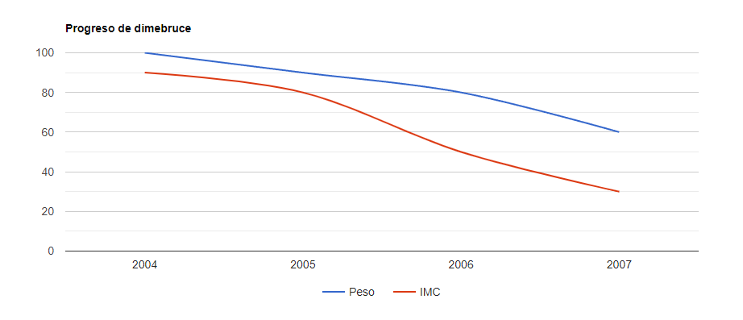
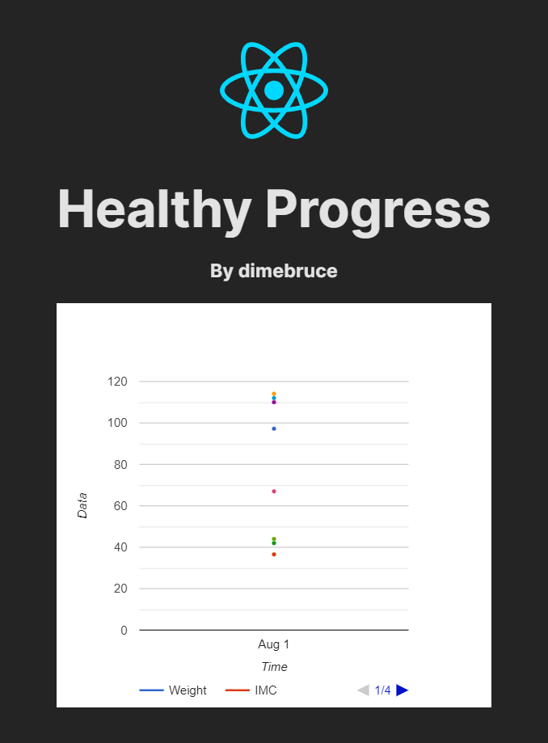

# Healthy Progress - Tu Proyecto

Este es el repositorio de tu proyecto **Healthy Progress**, una aplicación web para monitorear el progreso de tu salud y estado físico. 

## Descripción

Healthy Progress es una aplicación que te permite llevar un registro detallado de tu peso y otras medidas corporales a lo largo del tiempo. Podrás visualizar tus datos en forma de gráficas para tener una mejor perspectiva de tu progreso.

## Características

- Registro de Peso, Pecho, Cadera, Glúteo, Gemelos y otras medidas importantes.
- Cálculo automático del Índice de Masa Corporal (IMC) basado en el peso y altura.
- Gráficas interactivas para visualizar tu progreso en el tiempo.
- Actualización semanal de tus medidas para un seguimiento constante.

## Tecnologías Utilizadas

- React: Biblioteca de JavaScript para la interfaz de usuario.
- Vite: Herramienta para el desarrollo rápido de aplicaciones web.
- React Google Charts: Librería para la creación de gráficas en React.

## Cómo usar

1. Clona este repositorio en tu máquina local.
2. Instala las dependencias usando `npm install` o `yarn install`.
3. Ejecuta el servidor de desarrollo con `npm run dev` o `yarn dev`.
4. Visita [http://localhost:3000](http://localhost:3000) en tu navegador.

## Ejemplo de Gráfica

## Captura de Pantalla

## Contribuciones

¡Tus contribuciones son bienvenidas! Si encuentras algún error o tienes una mejora que aportar, por favor crea un pull request o abre un issue en este repositorio.

¡Gracias por tu interés en Healthy Progress!

© 2023 Hecho por [dimebruce](https://www.instagram.com/dimebruce)
